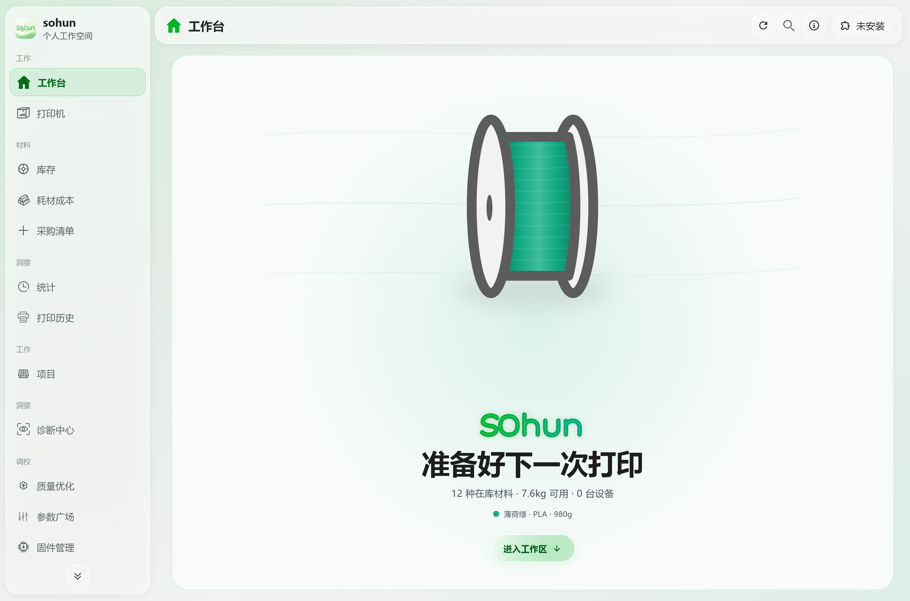
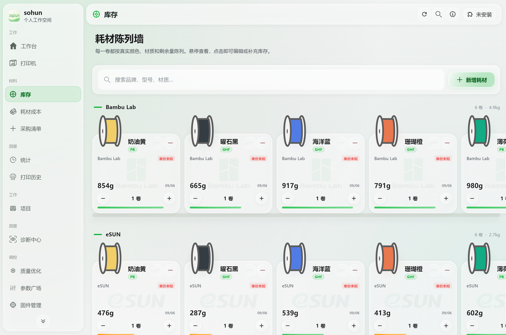
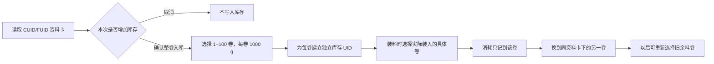

# sohun 耗材工作台

面向个人 3D 打印用户的耗材库存、实物卷追踪、打印机与设备工作台。Windows 桌面端负责日常管理，Android 客户端负责移动查看与 NFC 标签操作；两端可以使用同一个 sohun 个人账号同步。

[访问官网](https://sohun.top) · [下载安装器](https://github.com/dkdjndbfj-wq/sohun/releases/download/core-v1.0.1%2B2/sohun-core-preview-setup-1.0.1-2-windows-x64.exe) · [下载便携版](https://github.com/dkdjndbfj-wq/sohun/releases/download/core-v1.0.1%2B2/sohun-core-preview-1.0.1-2-windows-x64.zip) · [下载 Android 调试版](https://github.com/dkdjndbfj-wq/sohun/releases/download/core-v1.0.1%2B2/sohun-core-preview-1.0.1-2-android-debug.apk) · [查看版本说明](https://github.com/dkdjndbfj-wq/sohun/releases/tag/core-v1.0.1%2B2)

当前公开版本为 **1.0.1+2 Core Preview**，标签为 **`core-v1.0.1+2`**。这是用于公开体验与验证的预发布版本：Windows 包没有 Authenticode 发布者签名，Android APK 使用调试证书。具体手机、标签、打印机和固件的兼容性仍需实机确认。

本次已完成库存、标签职责、账号隔离、启动交接和原生 NFC 的专项回归，具体范围见 [验证记录](docs/release-validation-1.0.1.md)。欢迎在 [Issues](https://github.com/dkdjndbfj-wq/sohun/issues) 反馈问题，注明版本、设备和复现步骤；请勿附带账号密码、密钥或真实个人数据。



> 截图由项目中的真实界面组件渲染，内容是示例数据，用于说明布局和操作入口。它不构成打印机、NFC 标签或公网服务已经通过实机验收的证明。

## 它解决什么问题

管理耗材时，你需要知道正在使用哪一卷、余料卷还剩多少、同一张资料卡先后对应过哪些卷。sohun 把耗材资料、入库批次、实物卷、当前装载和消耗记录分开保存，使一张可重复使用的 CUID/FUID 资料卡能够服务多卷耗材，同时保留每一卷自己的余量和历史。

| 能力 | 作用 |
| --- | --- |
| 个人耗材库存 | 按品牌、型号、材料、颜色、批次和实际克数管理库存 |
| 实物卷追踪 | 每一卷都有独立库存 UID；换卷不会覆盖旧卷的余量与消耗 |
| CUID/FUID 资料卡 | 读取资料、兼容模板写卡与登记、批量增加 1–100 卷、选择具体卷上机和复用旧余料 |
| 打印与供料位 | 将打印任务和实际供料位关联到具体库存卷，按卷记录消耗 |
| 账号同步 | Windows 与 Android 使用同一 sohun 账号同步库存与事件；本地数据按服务器和稳定用户 ID 隔离 |
| NTAG213 设备工作台 | 定位打印机并打开状态、故障、维护和摄像头入口，不参与耗材库存 |
| 社区与参数 | 浏览社区内容、材料参数及相关工作台入口 |
| 桌面启动页 | 固定窗口中的简洁品牌页、真实加载进度、短暂淡入淡出；支持关闭动画与系统减少动画设置 |



> 库存截图同样使用组件示例数据。真实余量取决于用户录入、打印消耗与现场核对。

## CUID/FUID：一张资料卡，多次入库，多卷独立追踪

CUID/FUID 在 sohun 中是**可重复使用的耗材资料卡**，不要求一卷耗材配一张卡，也不会把一次读取永久绑定为“一卡一卷”。耗材资料、写卡登记、扫码入库、余量和换卷追踪只由 CUID/FUID 完成。

**每个实物卷的容量固定为 1000g，不能选择其他规格。** 库存中 500g 表示原本 1000g 的一卷剩余 500g；批量 5 卷则是 5 个独立实物卷，总量 5000g。**余量严格大于 30g 才能重新装入或继续使用**，例如 31g 可以，30g 不可以。低余量记录仍保留，系统不会自动把它清零；用户确认用完后才结算。

读取资料卡后，用户可以选择本次增加的数量，整卷模式范围为 **1–100 卷，每卷按 1000 g 登记**；余量模式登记一卷，填写大于 0 且不超过 1000 g 的实际余量。确认后，系统为每一卷建立独立库存记录；选择取消、关闭或移除待办时不会增加库存，同一入库操作重试也不会重复新增。



例如，同一张蓝色 PLA 资料卡一次登记 A、B 两卷：

1. 先装入 A 卷，用到 **415 g** 后换下，A 的 415 g 会保留。
2. 再装入 B 卷，系统把 B 记为当前卷，A 作为可继续使用的余料卷保留。
3. 以后把同一张卡用于装机，在进料确认弹窗中选择已有的 A 卷继续使用；继续消耗 25 g 后，A 为 **390 g**，B 的余额不变。
4. 手机、桌面和服务器同步时，两卷仍是两个独立库存 UID，不会因为资料卡 UID 相同而合并或补满。

同一张卡可以反复用于后续批量入库。系统会记录资料卡来源、入库回执、标签周期和前后卷关系，当前卷与历史卷使用各自的生命周期状态。若同一 UID 存在多个候选卷，界面会要求选择实际装入的那一卷，避免把消耗扣到错误库存。

检测到物理取下时，系统暂停该供料位，保留原卷余量与未结算任务。取消弹窗也不会把余料卷清零。选择“维修暂取”后可装回原卷续用；普通取下或换料后，需要确认实际装入哪卷。只有明确选择“已用完”并再次确认，才执行耗尽结算。等待确认期间的云同步不会把临时取下误记成永久换卷。

兼容模板写卡使用用户持有的完整 AMS 源标签或导出文件，写入后校验块内容与真实 UID。品牌、型号、颜色等自定义资料由应用关联管理，不宣称能把任意自填资料改写成厂商认证标签。

克隆出的多张同 UID 卡无法仅凭 UID 自动区分为不同实物。遇到这种情况仍需在供料位确认具体库存卷；软件不会猜测，也不会把多卷余额相加。

详细操作和卡片格式见 [CUID/FUID 手机与模板说明](电脑软件/docs/手机RFID模板使用说明.md)。读写校验和自动化测试通过，不代表所有手机、卡片、打印机与固件已经完成实机兼容验收。

## NTAG213：独立的设备入口

NTAG213 与耗材链路严格分开。它只用于打印机设备工作台，可以贴在打印机旁，碰卡后定位对应设备并打开：

- 设备状态、当前任务、进度、温度和最后上报时间；
- 已共享的故障记录及处理情况；
- 巡检、清洁、润滑、皮带检查、喷嘴或热端更换等维护记录；
- 用户配置的 HTTPS 摄像头页面或直播入口。

NTAG213 **不写入耗材资料、不登记库存、不增加卷数、不保存余量，也不参与打印消耗计算**。碰设备标签不会自动开始打印、加热、暂停或停止机器；标签本身不保存账号密码或打印机凭据，实际访问仍由 sohun 账号权限控制。

使用方法与权限边界见 [NTAG213 设备工作台说明](电脑软件/docs/NTAG213设备工作台使用说明.md)。

## 账号、离线与同步

Windows 和 Android 可以登录同一个 sohun 个人账号。个人库存的本地归属由**规范化服务器地址 + 服务端稳定用户 ID**组成，不再只用邮箱判断，因此以下情况不会自动串用旧库存：

- 删除账号后用同一邮箱重新注册；
- 在不同自托管服务器上使用同一邮箱；
- 多人共用一个 Windows 登录并切换不同 sohun 账号。

切换账号时，库存列表、用量、供料位候选、打印选择、换卷和 CUID/FUID 识别候选都使用当前账号作用域。切回原账号后，其库存和既有装载关系仍可恢复查看。未登录时，操作保存在本机的匿名个人空间；首次登录接管旧数据时会检查完整的标签生命周期、入库回执与事件归属，发现混合账号关系会停止迁移并要求核对。

同步保留每卷稳定 UID、余额、标签周期、来源批次和不可变事件。两台设备上的独立改动通过带版本的快照合并；无法安全自动判断的同卷余额冲突会保留两份候选，交由用户核对，不会静默丢弃其中一端。

发布版默认连接 `https://api.sohun.top`。自托管或测试构建可以使用：

```powershell
--dart-define=APP_API_BASE_URL=https://your-api.example
```

## 下载与安装

安装包发布在 [GitHub Releases](https://github.com/dkdjndbfj-wq/sohun/releases/tag/core-v1.0.1%2B2)，也可以从 [官网下载区](https://sohun.top/#download) 选择平台。对应的 [SHA-256 校验清单](https://github.com/dkdjndbfj-wq/sohun/releases/download/core-v1.0.1%2B2/SHA256SUMS.txt) 与安装包在同一版本页面提供。

### Windows 10/11 x64 安装器

下载 [`sohun-core-preview-setup-1.0.1-2-windows-x64.exe`](https://github.com/dkdjndbfj-wq/sohun/releases/download/core-v1.0.1%2B2/sohun-core-preview-setup-1.0.1-2-windows-x64.exe)，核对 GitHub Release 中的版本和校验信息后运行安装器。Core Preview 安装器当前没有 Authenticode 发布者签名，Windows 可能显示未知发布者提示。

### Windows 10/11 x64 便携版

下载 [`sohun-core-preview-1.0.1-2-windows-x64.zip`](https://github.com/dkdjndbfj-wq/sohun/releases/download/core-v1.0.1%2B2/sohun-core-preview-1.0.1-2-windows-x64.zip)，完整解压到可写目录，再运行其中的 `sohun.exe`。不要只从压缩包内单独启动 EXE，也不要把新版 EXE 覆盖进旧目录，以免混用不同版本的 DLL 和资源。

### Android 调试 APK

下载 [`sohun-core-preview-1.0.1-2-android-debug.apk`](https://github.com/dkdjndbfj-wq/sohun/releases/download/core-v1.0.1%2B2/sohun-core-preview-1.0.1-2-android-debug.apk)，在 Android 系统安装页确认安装。该 APK 使用调试证书，适合 Core Preview 功能验证。使用 CUID/FUID 或 NTAG213 需要支持相应 NFC 能力的 Android 设备；不同厂商系统、标签批次和 NFC 芯片仍需现场测试。

项目目前没有 macOS 或 iOS 交付入口。

## 常见问题

### 读取 CUID/FUID 会立即增加库存吗？

不会。读取后会显示入库确认，可选择 1–100 卷；点击取消或关闭不会增加库存。确认成功后，每卷才会得到独立库存 UID。

### CUID/FUID 用完一卷后还能继续用吗？

可以。它是耗材资料卡，可以反复登记同类耗材。旧卷、余料卷和新卷分别保存，卡片本身不代表某一卷只能使用一次。

### 为什么再次扫描时要我选择具体卷？

因为同一张资料卡可能登记过多卷，也可能有 415 g 之类的旧余料。明确选择实际装入的卷，才能把打印消耗记到正确余额。

### 换卷会把旧余料清零或把新卷补到旧记录吗？

不会。换卷只改变当前标签周期和供料位指向。旧卷保留原余额、用量和来源，新卷使用自己的库存 UID。

### NTAG213 能否写耗材资料或扫码入库？

不能。NTAG213 只打开设备工作台。所有耗材资料、写卡、入库、余量和换卷操作都使用 CUID/FUID。

### 两个人共用一台电脑会看到彼此库存吗？

登录不同 sohun 个人账号时，本地库存、用量、供料位选择和打印操作按账号隔离。退出账号后不会把前一个账号的库存当作匿名库存展示。

### Core Preview 是完整签名的正式发行版吗？

不是。当前 Windows 包未做 Authenticode 签名，Android APK 使用调试证书，并以 GitHub Prerelease 发布。它用于公开体验和验证现有功能边界。

### 自动化测试通过是否代表我的硬件一定兼容？

不代表。自动化测试覆盖数据链路、UI、NFC 协议模拟、API 和构建；具体手机、实体卡、读写距离、打印机型号及固件行为需要实机确认。

## 从源码运行

主要工具链与 CI 对齐：Flutter **3.44.4**、Node.js **24**，Windows 构建需要 Visual Studio 2022 的“使用 C++ 的桌面开发”组件；Android 构建需要 Android SDK。

```powershell
Set-Location 电脑软件
flutter pub get
dart analyze lib test
flutter test --no-pub --concurrency=2 --dart-define=SOHUN_CORE_BUILD=true

Set-Location community_server
npm ci
npm test
```

构建固定清单的 Core Preview Windows 安装器、便携包和 Android 调试 APK：

```powershell
./scripts/public_core_build.ps1 -Target All -Installer -RunTests
```

脚本会导出独立源码快照、使用英文临时路径构建、检查成品边界并生成 SHA-256 清单。更完整的命令与验收范围见 [开发与验证工作流](docs/development-workflow.md)，部署配置见 [DEPLOYMENT.md](DEPLOYMENT.md)，公开构建限制见 [PUBLIC_RELEASE_MANIFEST.md](PUBLIC_RELEASE_MANIFEST.md)。

## 仓库结构

| 路径 | 内容 |
| --- | --- |
| `电脑软件/lib`、`电脑软件/test` | Flutter Windows/Android 共享客户端及测试 |
| `电脑软件/lib/main_mobile.dart`、`电脑软件/android` | Android 入口和原生 NFC 实现 |
| `电脑软件/community_server` | sohun 社区与个人库存 API |
| `官网网页制作` | 官网、下载入口与公开页面 |
| `手机软件` | 早期浏览器原型，仅作历史参考 |
| `scripts`、`.github/workflows` | 验证、Core 导出、构建与发布流程 |

开发约定见 [AGENTS.md](AGENTS.md)。仓库地址为 [dkdjndbfj-wq/sohun](https://github.com/dkdjndbfj-wq/sohun)。

## 许可与资源边界

项目源码按 [MIT License](LICENSE) 发布。品牌名、商标、产品图片和其他第三方资源仍归各自权利人所有，其存在不等于随 MIT 源码重新授权；来源与说明以 [`电脑软件/THIRD_PARTY_NOTICES.md`](电脑软件/THIRD_PARTY_NOTICES.md) 为准。

Core Preview 不包含未完成公开分发审查的 Bambu 私有资源、预置校准模型、离线故障资料、私有网络组件以及 FFmpeg/libmpv 等二进制。公开仓库和构建清单也排除数据库、日志、账号令牌、SMTP 密码、GitHub PAT、代码签名私钥与 `.env` 文件。详细范围和发布门禁见 [公开仓库发布边界](PUBLIC_RELEASE_MANIFEST.md)。
