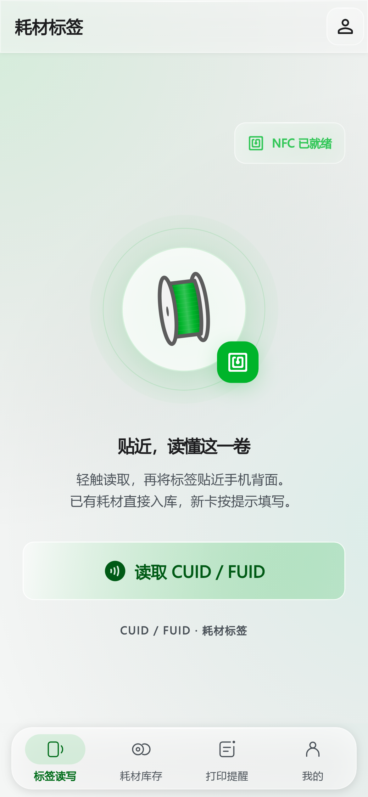
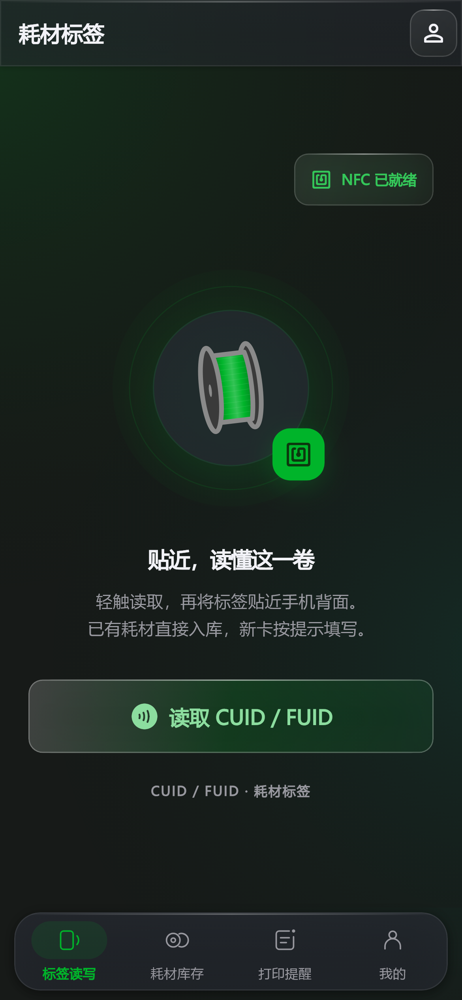
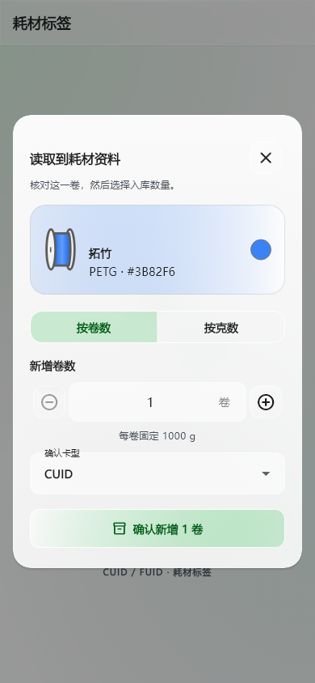
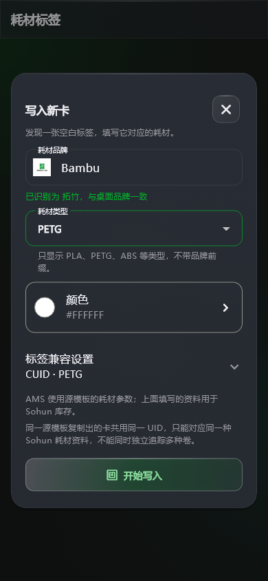
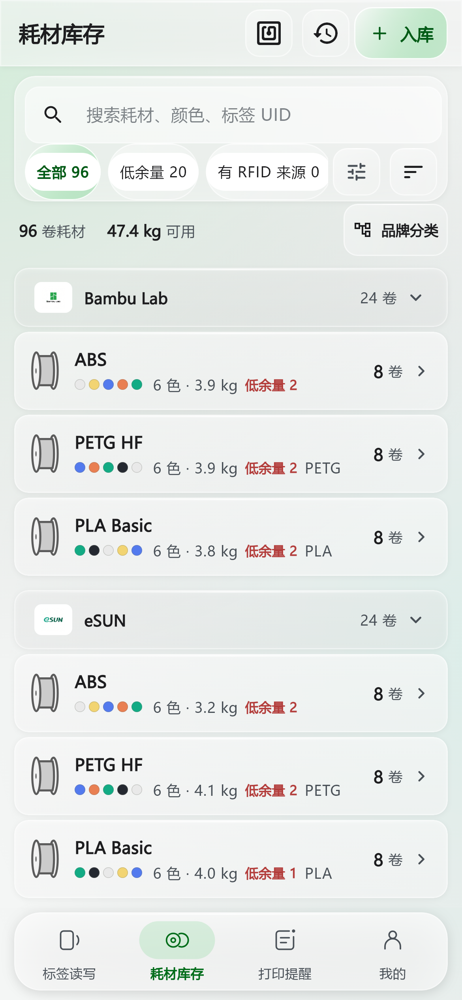
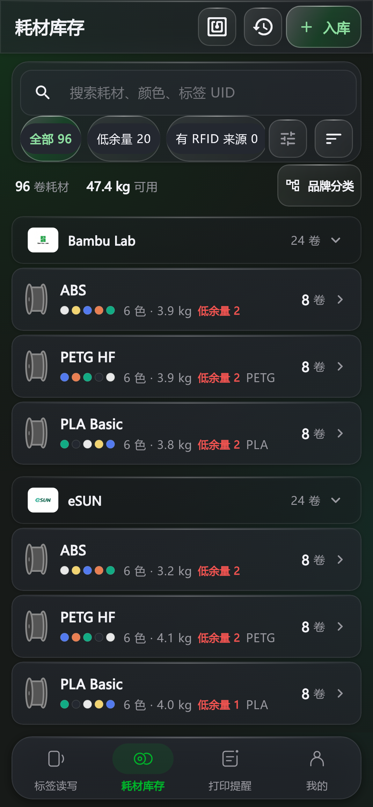

# 手机读卡、写卡与入库图文指南

适用版本：**Android 1.0.2+5**。这份指南从手机中的“耗材标签”首页开始，说明 CUID/FUID 耗材资料卡的读取、新卡写入和库存同步。

[下载 Android APK](https://github.com/dkdjndbfj-wq/sohun/releases/download/v1.0.2%2B5/sohun-1.0.2-5-android.apk) · [查看新版说明](releases/1.0.2-5.md) · [返回项目介绍](../README.md)

本文预览来自当前客户端的真实 Flutter 组件，使用示例耗材和模拟 NFC 状态。页面布局与软件一致；真实 NFC 读写、实体卡及 AMS 兼容性仍需用自己的设备测试。

## 1. 准备手机和卡片

底部四个导航入口使用专属 SVG 图标，分别对应“标签读写”“耗材库存”“打印提醒”“我的”。选中状态会突出当前入口，浅色和深色主题自动使用相应颜色；图标更新不改变原来的导航操作。

耗材流程使用已确认卡型的 **CUID/FUID，4 字节 UID、MIFARE Classic 1K 兼容卡**。仅靠一次扫描不能自动确认商品卡型，请按购买的卡片规格选择。写入使用标准 Block 0 写入能力，部分卡片、手机 NFC 芯片或系统不具备相应能力。

先在 Android 系统设置里开启 NFC，然后打开 Sohun，进入底部“标签读写”。首页自动显示 NFC 是否就绪；从设置返回软件时会重新检测。未开启或设备不支持时会显示对应提示。

<table>
  <tr>
    <td align="center"> 浅色首页</td>
    <td align="center"> 深色首页</td>
  </tr>
</table>

首页的主操作只有 **“读取 CUID / FUID”**。点击后，把卡贴近手机 NFC 天线区域，保持位置直至读取完成。天线位置依手机型号而异，通常需要在手机背部寻找最稳定的位置。读取期间页面显示状态，点击取消可结束等待。

## 2. 已有资料卡：先核对，再选择入库数量

完整读取成功后，会打开**居中的“读取到耗材资料”弹窗**。顶部集中展示品牌、耗材类型、颜色和对应的品牌图片。已有 Sohun 资料优先用于展示；没有本地关联资料时，显示读取到的源模板耗材参数。

下面选择本次入库方式：

| 方式 | 如何填写 | 保存结果 |
| --- | --- | --- |
| 按卷数 | 选择 1–100 卷，可点加减或直接输入整数 | 每一卷单独建立库存记录，每卷固定 1000g |
| 按克数 | 输入当前实际余量，严格大于 30g、不超过 1000g | 登记一卷 1000g 实物卷，当前余量使用填写值 |

例如，新到货 3 卷蓝色 PETG，选择“按卷数”，输入 `3` 并确认，会建立 3 卷独立记录，总量 3000g。另一卷原本 1000g、现在还剩 415g，选择“按克数”，输入 `415`，保存的是这卷的当前余额；它的名义容量仍为 1000g。

若软件此前没有记录卡型，弹窗会要求确认 CUID 或 FUID。核对资料后点击底部确认按钮才入库。关闭、取消或只读后返回都不会增加库存，也不会改写卡片。

同一张资料卡可以反复用于后续到货。每次确认产生新的入库批次和独立实物卷 UID；旧卷的余额与历史保留。把同一张卡重复读一遍，并不表示旧卷自动补满。

## 3. 空白新卡：填写品牌、类型和颜色

软件确认完整卡片结构为空白后，才打开独立的**“写入新卡”居中弹窗**。超时、贴卡中断、认证失败和不支持的卡片会显示读取错误，不会被误判为新卡。

先填写三个常用项目：

1. **耗材品牌**：输入拓竹、Bambu、eSUN 等，也可以使用自己的品牌名称。
2. **耗材类型**：选择 PLA、PETG、ABS、ASA、TPU 等。类型表达材料本身，不带“Bambu”“eSUN”等品牌前缀。
3. **颜色**：打开居中颜色选择器，选取实际颜色，可保留颜色名称供库存显示。

品牌别名会合并为手机、桌面共用的名称，避免同一种品牌被拆成多组：

| 输入示例 | 统一名称 |
| --- | --- |
| `拓竹` / `bambu` / `Bambu Lab` / `BBL` | 拓竹 |
| `eSUN` / `e-sun` / `易生` | eSUN |
| 其他自定义品牌 | 去掉首尾空格后保留用户名称 |

识别出受支持的品牌后，使用同一品牌图片规则展示。品牌和类型是不同字段，例如“拓竹 + PETG”，不需要填写“拓竹 PETG”作为材料类型。

### 第一次写卡：先保存一份源模板

AMS 标签包含源数据和签名区域，单凭自己填写品牌、材料、颜色无法生成厂商认证数据。当前写入流程恢复**完整的已有源模板**，自填资料由 Sohun 库存关联管理。

第一次使用时按这个顺序操作：

1. 用首页读取自己持有的拓竹原厂或已验证兼容的源标签。完整模板会按当前账号加密保存在手机本机。
2. 如果只想保存模板，关闭入库确认即可，库存不会增加。
3. 再读取空白 CUID/FUID，填写耗材资料，展开“标签兼容设置”。
4. 选择本机保存的 **AMS 兼容源模板**，并确认目标卡是 CUID / Gen2 还是 FUID。
5. 点击“开始写入”，按提示贴近目标卡。保持贴卡，等待写入、回读全部 64 块和真实 UID 校验完成。

只有完整校验成功后，软件才登记这卷库存。写入中断、拒写、UID 不一致或回读失败不会被标记为写入成功。

**AMS 将读取源模板原有的耗材参数；Sohun 显示和同步你填写的品牌、类型与颜色。** 例如，选择一份 PLA 源模板并填写 PETG，不会使 AMS 自动把这个签名模板变成 PETG 标签。请选择适合实际耗材的源模板，并在真实 AMS 上核对识别结果。

FUID 的 UID 通常只有一次写入机会。先确认卡片规格和源模板；中断或失败后保留源数据，核对卡片状态再继续。

## 4. 在手机库存查看，在桌面继续管理

确认入库后进入底部“库存”。页面支持按品牌、材料和颜色查看，使用搜索、筛选找到目标耗材，并查看具体实物卷的当前余量。

<table>
  <tr>
    <td align="center"> 浅色库存</td>
    <td align="center"> 深色库存</td>
  </tr>
</table>

Windows 和 Android 登录同一个 Sohun 个人账号后，可以同步库存与事件。离线时先保存在本机，网络恢复后继续同步；若界面提示“云端待同步”，说明本地操作已保存、云端仍需完成同步。

每一卷有独立库存 UID。共享同一资料卡的多卷，在装料时仍要选择**实际装入的具体卷**。旧余料卷不会因换卷而被清零，也不会和新卷合并。余量严格大于 30g 才能继续使用或重新装入；30g 及以下保留记录，只有明确确认用完才结算。

同一源模板复制出的卡共用同一 UID，软件无法仅靠 UID 自动区分它们。此 UID 对应的 Sohun 资料应保持一致，软件会拒绝把同一源模板登记成不同品牌、材料或颜色。多卷仍可分别入库，但现场使用时需要确认具体实物卷。

完整模板、原始块、密钥和签名只加密保存在本机，不上传 Sohun 云端。跨端同步的是库存资料、余量、来源卡片信息和事件；不要把本机模板库当成跨设备自动同步文件夹。

## 设备标签与耗材标签

**CUID/FUID** 用于耗材资料、写卡、入库、余量和换卷追踪。**NTAG213** 只用于独立的打印机设备工作台，可以定位设备并打开状态、故障、维护及配置的摄像头入口。

NTAG213 不保存耗材资料、不增加库存、不保存余量，也不参与打印消耗。碰设备标签不会自动加热、开始或停止打印，设备访问仍受账号权限控制。

## 遇到问题时

| 现象 | 先检查什么 |
| --- | --- |
| 首页显示 NFC 未开启 | 在系统设置开启 NFC，再返回软件 |
| 读取失败但没有写入弹窗 | 重新贴卡并保持稳定；失败不能证明是空白卡 |
| 写卡提示没有源模板 | 先读取完整源标签，再关闭入库确认并读取空白卡 |
| 类型显示 PLA、PETG，没有品牌名 | 这是当前设计；品牌在上一个字段单独填写 |
| AMS 识别和 Sohun 自填资料不同 | AMS 使用未改动的源模板参数，核对所选模板 |
| 同一 UID 被拒绝登记成另一种耗材 | 当前 UID 已对应其他资料，改用相符源模板并核对已有记录 |
| 更新安装提示签名冲突 | 可能正在覆盖旧调试包；先同步或备份库存，避免卸载丢失本地数据 |

反馈问题请到 [GitHub Issues](https://github.com/dkdjndbfj-wq/sohun/issues)，附上软件版本、Android 与手机型号、卡型、操作步骤和错误提示。可以提供遮挡个人信息后的界面截图，不要上传账号凭据、私钥或完整原始标签模板。
